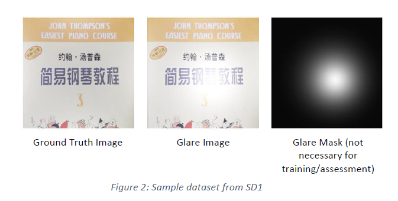
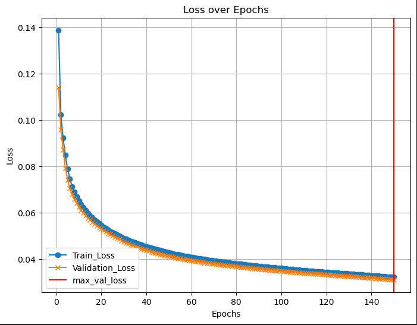
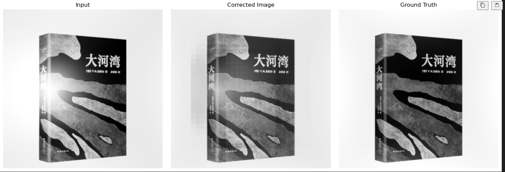

## Introduction
This is a computer vision based solution to remove glare from greyscale images. The solution uses a autoencoder model with an UNET type architecture to remove the glare from greyscale images. The SD1 dataset is used to train the model and it can be found here:
[Dataset](https://drive.google.com/file/d/1r4OyMN-4aBEXP-usvrvOvNCEJhoQIRnL/view)

The SD1 dataset contains 12,000 training samples (12000), 650 validation samples. The images are with dimension [w:1536, h: 512], in which the ground truth, glare image and glare mask are stitched together. The glare mask is not necessary for training and assessment.

## Methodology
The model used is a convolutional autoencoder, with skip connections added, resembling an Unet model. Skip connections to preserve spatial details lost during downsampling. Withoout skip connections, the the generated image will be blurry.

<strong> Model Architecture </strong>:

The input is downsampled 5 times, with the 5th layer being the bottleneck. Then, the decoder unsamples 5 times as well to reconstruct the image, concatenating the skip connections sequentially from the 4th encoder layer, up till the first encoder layer.
The model takes in the glare-affected grayscale image (input) and generates a grayscale image with no glare. The output is compared with ground truth image with no glare (target).
<strong> Assumptions </strong>: Input image will be grayscale and of size 512x512. Input to model must also be a tensor.

## Training
<strong>Loss Function</strong>: L1 Loss (Mean Absolute Error)

<strong>Optimizer</strong>: Adam

<strong>Early Stopping</strong>: Early stopping is implemented to prevent overfitting. EarlyStopper monitors validation loss and saves the model with the lowest validation loss after every epoch. If the validation loss doesn’t improve after a defined number of iterations (patience), training stops.

<strong>For each epoch</strong>:
The model is trained on train_loader and subsequently evaluated on val_loader. The losses from training and validation are stored for plotting later.

## Results 
Here are the training loss curve, the model is able to achieve a loss of 0.0310.

Here is a visual evaluation of the model performance.

## Deployment
1. To build the docker image, in which htx-app is the name of the app:
docker build -t htx-app .

2. To run the docker image:
docker run -p 4000:4000 htx-app

3. Type localhost:4000/infer with POST method using Postman, under body, form-data, rename the key to image and change its type to File, upload the image inside the value column, for the /infer API. I have provided test1.png for the testing out the /infer API.

Alternatively, you can type localhost:4000/docs to try out /infer API endpoint.

